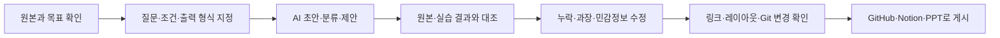

# AI 활용 및 검증 워크플로

> 생성형 AI를 정답 생성기가 아니라 질문 정리·자료 구조화·초안 작성·검수 보조 도구로 활용하고, 최종 판단과 실행 결과는 직접 확인합니다.

## 교육 과정에서 달라진 점

인프라 보안 교육을 계기로 GitHub와 Notion을 처음 도입했습니다. 교육과 프로젝트를 진행하면서 Codex와 Gemini에 질문하는 방법, 필요한 결과 형식을 설명하는 방법, 초안의 누락과 오류를 찾아 수정하는 방법을 익혔습니다.

동시에 GitHub·Notion을 처음 도입해 학습·프로젝트 자료와 변경 이력을 연결한 공개 포트폴리오로 운영하게 되었습니다. Drive·OneDrive·Zoom·OBS Studio·미리캔버스는 팀 협업과 콘텐츠 제작에 필요한 범위에서 활용했습니다. 도구 이름보다 목적에 맞는 선택과 결과 검증을 우선합니다.

## 취업 포트폴리오에서 보여주는 역량

- **AI 활용:** 질문과 제약을 구체화하고 초안의 누락·오류를 수정합니다.
- **문서화:** 기술 결과를 보고서·PPT·GitHub·Notion으로 전달 가능하게 정리합니다.
- **도구 적응:** 처음 접한 GitHub·Notion을 실제 공개 포트폴리오 운영까지 연결했습니다.
- **사람의 검증:** 실행 결과·로그·원본·공개 범위를 최종 판단합니다.

## 반복해서 사용하는 절차

## 실제 활용 사례

| 사례 | AI와 도구를 활용한 부분 | 내가 직접 판단·검증한 부분 | 남아 있는 결과물 |
|---|---|---|---|
| 학습자료 → 공개 포트폴리오 | 여러 형식의 자료 분류, 문서 목차와 초안 작성, GitHub·Notion 구조화 | 실제 수업 범위와 완료 근거 대조, 팀 성과와 개인 기여 분리, 공개 범위 결정 | README, CURRICULUM, 기술 증거표, 프로젝트 3건, 공개 Notion |
| TENsion 최종자료 → Project 03·PPT | 보고서와 기여문서 요약, 문장 다듬기, 기존 PPT 디자인을 유지한 확장 작업 | 개인 책임 범위와 팀 집계값 해석, HTTP 응답·로그 근거 확인, 전체 슬라이드 시각 검수 | [Project 03](projects/03-tension-estmall-security-project.md), 10장 포트폴리오 PPT |
| 장시간 강의 → 복습노트 | 로컬 음성 인식 도구로 구간 전사, 타임스탬프 기반 내용 분류와 요약 보조 | 원영상 표본과 전사·요약 비교, 중요한 개념과 오류 수정, 전체 전사문 비공개 | [웹 보안 학습노트](labs/05-web-security.md), 로컬 전사·복습 자료 |
| 오류·설정 질문 → 재검증 | 증상 설명, 점검 순서와 설정·명령 후보 정리 | 허가된 실습 환경에서 직접 실행하고 응답·서비스 상태·로그로 확인 | 트러블슈팅 기록, 프로젝트 검증 절차 |
| 보고서·발표 편집 | Gemini·Codex의 문장·구성 제안, 미리캔버스 AI와 템플릿 편집 | 목적에 맞는 내용 선택, 사실관계·가독성·레이아웃 확인 | 보고서·PPT·시연 및 복습 자료 |

## 목적별 도구 활용 경험

| 목적 | 활용 경험 | 적용 방식 |
|---|---|---|
| 질문·자료 분석 | Codex, Gemini | 개념 질문, 오류 원인 탐색, 문서 구조와 표현 개선 |
| 기록·버전 관리 | Git, GitHub, Notion | 학습노트와 프로젝트를 연결하고 변경 이력을 남김 |
| 보조 협업·콘텐츠 | Google Drive, OneDrive, Zoom, OBS Studio, 미리캔버스 | 팀 파일·온라인 협업·녹화·템플릿 편집에 필요한 범위로 활용 |
| 복습 자동화 | faster-whisper 기반 로컬 전사 | 장시간 영상을 타임스탬프 전사와 복습노트로 전환 |

각 도구는 교육과 프로젝트에서 직접 사용한 경험으로 표기하며, 전문가 수준이나 제품 개발 경험으로 과장하지 않습니다.

## 보안 직무에 맞춘 사용 원칙

- AI 답변과 생성 문장은 원본 자료·명령 결과·로그와 대조합니다.
- AI가 제안한 설정과 명령은 허가된 격리 환경에서만 직접 시험합니다.
- 팀 전체 결과와 개인이 수행한 범위를 분리합니다.
- 집계 건수를 정확도·탐지율처럼 바꾸어 표현하지 않습니다.
- 실제 IP·계정·비밀번호·세션·토큰·내부 경로는 공개 자료에서 제거합니다.
- 강의 원본, 팀 공동문서, 전체 전사문과 삭제된 대화 내용은 공개 증거로 사용하지 않습니다.
- 최종 게시 전 문서 링크, 레이아웃, Git 변경 파일과 민감정보 포함 여부를 다시 확인합니다.

## 직무에서의 활용 방향

보안관제·인프라 운영 업무에서도 AI를 이벤트 요약, 점검 절차 초안, 보고서 구조화와 반복 문서 작업에 활용할 수 있습니다. 다만 차단 여부, 설정 변경, 사고 판단과 외부 공유는 반드시 원본 로그·정책·서비스 상태를 확인한 뒤 결정하겠습니다.
