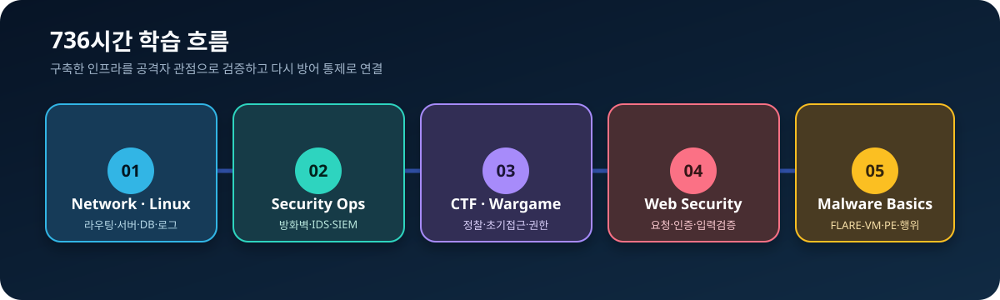
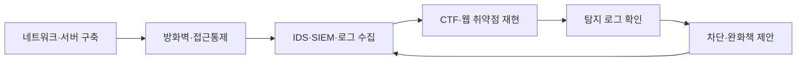

# 이순현 | 보안 인프라 포트폴리오

> 네트워크·서버를 구축하고, 허가된 교육용 환경에서 공격을 재현해 로그와 방어정책으로 검증합니다.

보안 인프라 운영과 보안관제(SOC) 직무를 준비하고 있습니다. 이 저장소는 이스트소프트 주관 K-디지털 트레이닝 과정에서 수행한 네트워크·서버 구축, 방화벽·IDS·SIEM 운영, CTF·웹 보안, 악성코드 분석 기초 학습을 **공개 가능한 범위로 다시 작성한 포트폴리오**입니다.

## 한눈에 보기

- 교육: `[이스트캠프] 가디언즈 정보보호 및 보안 인프라 운영 관리`, 2026.03.24 - 2026.08.07, 총 736시간 과정 이수 중
- 팀 프로젝트 3회: 인프라 통합 구축 1회, 보안 인프라 구축·공격 검증 1회, 웹 서비스 방어체계 구축·재검증 1회
- 팀 워게임: 3단원 팀 워게임 3위(팀 성과)
- CTF·취약 환경: VulnHub와 교육용 워게임 10개 이상 실습. 5개는 로컬 근거 확인, DoubleTrouble·Momentum·Potato·Venus 등은 증거 보완 상태를 표시해 문서화
- 웹 보안: OWASP Juice Shop 17개 도전 과제 해결, 39쪽 개인 실습 보고서 작성
- 목표 직무: 보안 인프라 운영, 보안관제/SOC, 네트워크·시스템 운영

## 포트폴리오 구성

| 구분 | 내용 | 바로가기 |
|---|---|---|
| 프로필 | 비전공 전환 배경과 현장 경험의 연결 | [PROFILE.md](PROFILE.md) |
| 전체 과정 | 인프라 구축부터 공격 검증·악성코드 기초까지 | [CURRICULUM.md](CURRICULUM.md) |
| 기술 증거 | 기술별 사용 맥락·행동·검증 방법·수준 | [SKILLS_EVIDENCE.md](SKILLS_EVIDENCE.md) |
| 인프라 기초 | 네트워크·Linux·서버 구축과 기본 점검 절차 | [labs/01-network-linux-foundation.md](labs/01-network-linux-foundation.md) |
| 보안 운영 | 방화벽·IDS·Wazuh·모니터링·로그 가시성 | [labs/02-security-operations.md](labs/02-security-operations.md) |
| 프로젝트 1 | SimmitPay 중앙 로그 수집 인프라 | [projects/01-simmitpay-central-logging.md](projects/01-simmitpay-central-logging.md) |
| 프로젝트 2 | Bossam Games 보안 인프라와 공격 검증 | [projects/02-bossam-security-infrastructure.md](projects/02-bossam-security-infrastructure.md) |
| 프로젝트 3 | TENsion·EstMall 보안 인프라 구축과 공격·방어 검증 | [projects/03-tension-estmall-security-project.md](projects/03-tension-estmall-security-project.md) |
| CTF | VulnHub 사례와 방어 관점 회고 | [labs/03-vulnhub-ctf.md](labs/03-vulnhub-ctf.md) |
| 시스템 워게임 | BOF·포맷스트링·권한·파일 보안 | [labs/04-system-wargame.md](labs/04-system-wargame.md) |
| 웹 보안 | DVWA·bWAPP/BeeBox·WebGoat·WAF 등 | [labs/05-web-security.md](labs/05-web-security.md) |
| 개인 사례 | Juice Shop 17개 과제 분석 | [labs/06-juice-shop-case-study.md](labs/06-juice-shop-case-study.md) |
| 악성코드 기초 | FlareVM·PE 구조·분석 절차 | [labs/07-malware-analysis-basics.md](labs/07-malware-analysis-basics.md) |
| 워게임 목록 | Bee-box·Account·Cookie·WebGoat·DVWA 등 | [labs/08-wargame-catalog.md](labs/08-wargame-catalog.md) |

## 학습을 연결한 방식

공격 실습의 목적은 기술을 과시하는 데 있지 않습니다. 서비스가 어떤 조건에서 무너지는지 확인하고, 방화벽·WAF·IDS·SIEM·계정 및 권한 정책으로 어떻게 줄일 수 있는지 연결하는 데 중점을 두었습니다.

## 기술 범위

- 네트워크: IPv4·서브넷, VLAN, 정적/동적 라우팅, OSPF, ACL, NAT, VPN/IPsec, Packet Tracer, GNS3
- 서버: Linux, DNS, Web, DB, FTP, MariaDB 복제, rsyslog, Docker
- 보안 인프라: pfSense, ASAv, nftables/NFQUEUE, HAProxy, ModSecurity, Snort, Suricata, OSSEC, Wazuh
- 관제·가시성: LogAnalyzer, Zabbix, Graylog, Splunk, Nagios, GoAccess
- 보안 검증: Nmap, Dirb/ffuf, Burp Suite, VulnHub, WebGoat, OWASP Juice Shop
- 분석 기초: BOF·포맷스트링 취약 코드, Linux 권한 상승 원인, FlareVM, PE·DLL·VA/RVA 개념

모든 기술은 `학습`, `실습`, `프로젝트` 수준으로 구분해 표기하며, 상용 환경 운영 경력으로 표현하지 않습니다.

## 공개 원칙

이 저장소의 모든 보안 실습은 본인 또는 교육기관이 허가한 로컬·격리 환경에서 수행했습니다. 공개 VulnHub와 소유·허가된 CTF의 풀이·명령·flag는 스포일러 표시 후 공개할 수 있습니다. 실제 사이트의 세션·토큰, 개인 비밀번호, 가상머신, 강의 원본과 팀 공동저작물은 공개하지 않습니다. 상세 기준은 [공개·비식별화 정책](governance/PUBLICATION_POLICY.md)을 따릅니다.

## 연락처

- Email: 2501lsh@naver.com
- GitHub: `github.com/leesoonhyun`
