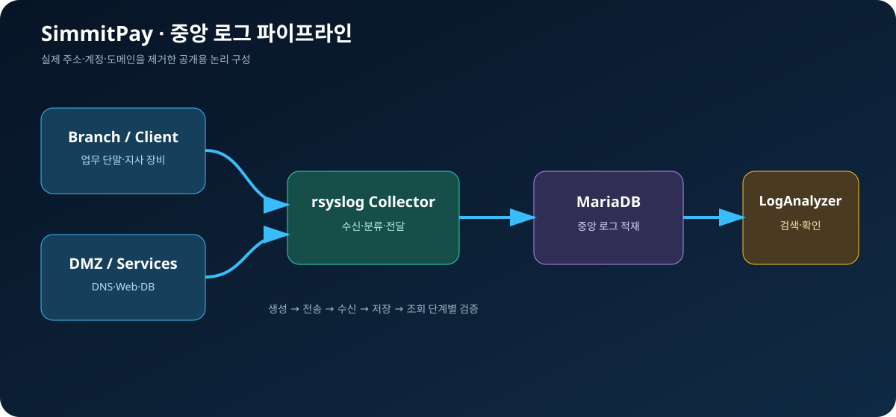
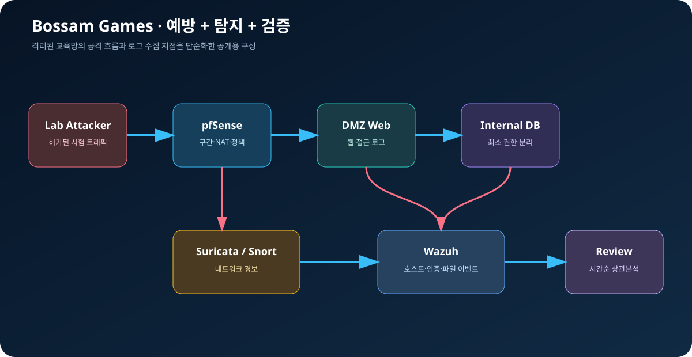
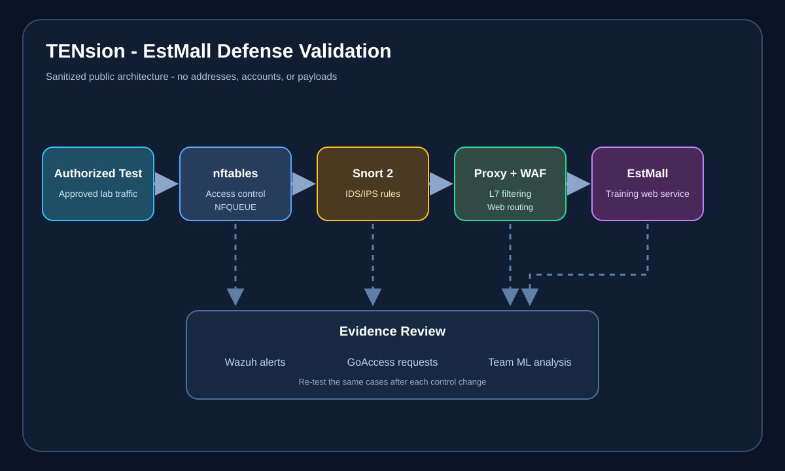
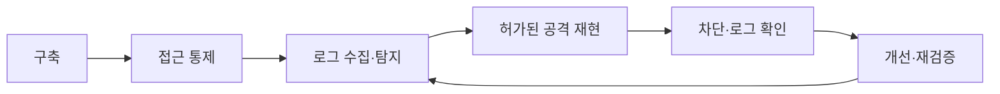

# 이순현 | 보안 인프라 포트폴리오

**네트워크·서버를 구축하고, 허가된 교육용 환경에서 공격을 재현해 로그와 방어정책으로 검증합니다.**

보안 인프라 운영 · 보안관제/SOC · 네트워크·시스템 운영

  
  
  
  

[Notion 포트폴리오](https://legendary-zenith-e52.notion.site/3a464fddf16c818cb2aeda73c60e1645) · [프로필](PROFILE.md) · [기술·증거](SKILLS_EVIDENCE.md) · [전체 교육과정](CURRICULUM.md) · [AI 활용 방식](AI_WORKFLOW.md)

---

## 핵심 요약

<table>
  <tr>
    <td align="center" width="20%"><strong>736시간</strong> 보안 인프라 교육</td>
    <td align="center" width="20%"><strong>팀 프로젝트 3회</strong> 구축·운영·공격 검증</td>
    <td align="center" width="20%"><strong>CTF 10개 이상</strong> 공개 근거 5건 연결</td>
    <td align="center" width="20%"><strong>Juice Shop 17개</strong> 개인 보고서 39쪽</td>
    <td align="center" width="20%"><strong>팀 워게임 3위</strong> 별도 팀 성과</td>
  </tr>
</table>

> 이 저장소는 이스트소프트 주관 K-디지털 트레이닝에서 수행한 학습과 프로젝트를 공개 가능한 범위로 다시 작성한 포트폴리오입니다. 기술은 `학습`·`실습`·`프로젝트` 수준을 구분하며 상용 운영 경력으로 표현하지 않습니다.

## 대표 프로젝트

<table>
  <tr>
    <td width="33%" valign="top">
      
      <h3>01 · SimmitPay</h3>
      <strong>중앙 로그 수집 인프라</strong>  
      <b>개인 역할</b> 
      서버 상세 설계, DNS·로그 서버, 보고서 초안  
      <b>검증 결과</b> 
      rsyslog → MariaDB → LogAnalyzer 수집·조회 흐름 확인  
      <a href="projects/01-simmitpay-central-logging.md"><b>프로젝트 보기 →</b></a>
    </td>
    <td width="33%" valign="top">
      
      <h3>02 · Bossam Games</h3>
      <strong>보안 인프라와 공격 검증</strong>  
      <b>개인 역할</b> 
      pfSense·Wazuh·IDS 환경 구축, 결과 문서화  
      <b>검증 결과</b> 
      공격 경로를 방화벽·로그·최소 권한 개선안으로 연결  
      <a href="projects/02-bossam-security-infrastructure.md"><b>프로젝트 보기 →</b></a>
    </td>
    <td width="34%" valign="top">
      
      <h3>03 · TENsion · EstMall</h3>
      <strong>보안 인프라 공격·방어 검증</strong>  
      <b>개인 역할</b> 
      Firewall·IDS/IPS 설계, nftables·Snort 2/NFQUEUE, 재검증  
      <b>검증 결과</b> 
      웹 공격 4종 차단과 Snort·WAF·Wazuh 로그 교차 확인  
      <a href="projects/03-tension-estmall-security-project.md"><b>프로젝트 보기 →</b></a>
    </td>
  </tr>
</table>

## 대표 검증 사례

<table>
  <tr>
    <td width="50%" valign="top">
      <h3>VulnHub · CTF</h3>
      
<b>10개 이상 실습 · 공개 근거 5건</b>

      
Mercury·Ripper·Breakout·Earth·Lupin의 정찰, 초기 침투, 계정 전환과 권한 상승 흐름을 방어 관점으로 다시 정리했습니다.

      <a href="labs/03-vulnhub-ctf.md">학습 현황</a> · <a href="writeups/vulnhub-documented-writeups.md">상세 풀이</a>
    </td>
    <td width="50%" valign="top">
      <h3>OWASP Juice Shop</h3>
      
<b>17개 도전 과제 · 개인 보고서 39쪽</b>

      
SQL Injection, 경로 검증, 약한 인증 사례를 요청·응답, 원인, 대응 방안과 재검증 순서로 기록했습니다.

      <a href="labs/06-juice-shop-case-study.md">개인 사례 보기</a>
    </td>
  </tr>
</table>

## 역량과 공개 근거

| 역량 | 수행 내용 | 대표 근거 |
|---|---|---|
| 네트워크·서버 구축 | VLAN·라우팅·ACL·NAT, Linux DNS·Web·DB·로그 서버 | [SimmitPay](projects/01-simmitpay-central-logging.md) |
| 보안 인프라 운영 | pfSense·nftables, Snort·Suricata, Wazuh, 로그 가시화 | [Bossam Games](projects/02-bossam-security-infrastructure.md) · [TENsion](projects/03-tension-estmall-security-project.md) |
| 공격 검증 | VulnHub, 시스템·웹 워게임, Juice Shop | [VulnHub](labs/03-vulnhub-ctf.md) · [Juice Shop](labs/06-juice-shop-case-study.md) |
| 문제 해결·문서화 | 현상 재현 → 범위 축소 → 변경 → 재검증 → 근거 기록 | [기술·증거 매트릭스](SKILLS_EVIDENCE.md) |
| AI 활용 | 초안·구조화 보조 후 원본·실행 결과·로그로 직접 검증 | [AI 활용 및 검증 워크플로](AI_WORKFLOW.md) |

<b>전체 학습 아카이브 펼치기</b>

### 인프라와 보안 운영

| 구분 | 내용 | 문서 |
|---|---|---|
| 인프라 기초 | 네트워크·Linux·서버 구축과 기본 점검 | [학습 노트](labs/01-network-linux-foundation.md) |
| 보안 운영 | 방화벽·IDS·Wazuh·모니터링·로그 가시성 | [학습 노트](labs/02-security-operations.md) |
| 전체 과정 | 인프라 구축부터 분석 입문까지의 학습 범위 | [교육과정](CURRICULUM.md) |

### 공격 검증과 분석 입문

| 구분 | 내용 | 문서 |
|---|---|---|
| 시스템 워게임 | BOF·Format String·권한·파일 보안 | [학습 노트](labs/04-system-wargame.md) |
| 웹 보안 | DVWA·bWAPP/BeeBox·WebGoat·WAF | [학습 노트](labs/05-web-security.md) |
| 워게임 환경 | Account·Cookie 등 교육용 환경 목록 | [카탈로그](labs/08-wargame-catalog.md) |
| 악성코드 분석 기초 | FLARE-VM·PE 구조·정적/동적 분석 절차 | [입문 노트](labs/07-malware-analysis-basics.md) |

## 작업 방식

공격 실습은 기술 과시보다 서비스가 무너지는 조건을 확인하고, 방화벽·WAF·IDS·SIEM·계정 및 권한 정책으로 위험을 어떻게 줄일지 연결하는 데 목적을 두었습니다. AI는 질문·구조화·초안·검토에 사용하며 최종 사실, 실행 결과, 보안과 공개 판단은 직접 확인합니다.

## 공개 원칙

- 본인 또는 교육기관이 허가한 로컬·격리 환경에서만 보안 실습을 수행했습니다.
- 실제 세션·토큰·비밀번호·내부 주소와 원본 ISO·OVA는 공개하지 않습니다.
- 팀 성과와 개인 기여를 분리하고, 근거가 부족한 항목은 보완 상태로 표시합니다.
- 상세 기준: [공개·비식별화 정책](governance/PUBLICATION_POLICY.md)

---

**이순현** · [2501lsh@naver.com](mailto:2501lsh@naver.com) · [GitHub](https://github.com/leesoonhyun) · [Notion](https://legendary-zenith-e52.notion.site/3a464fddf16c818cb2aeda73c60e1645)

