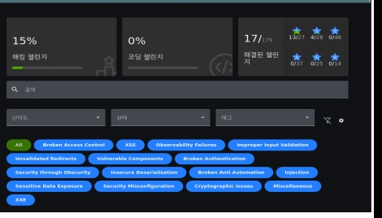

# Lab 06. OWASP Juice Shop Case Study

[← 포트폴리오 홈](../README.md) · [전체 교육과정](../CURRICULUM.md) · [기술·증거](../SKILLS_EVIDENCE.md)

## 결과

- Docker 기반 로컬 Juice Shop 환경 구성
- 17개 도전 과제 해결: 1성 13개, 2성 4개
- Burp Suite, dirb, 브라우저 개발자도구, URL 인코딩, wordlist 사용
- 풀이 과정과 주요 취약점 3건을 39쪽 개인 보고서로 작성

## 해결한 과제에서 다룬 범위

- 점수판·숨은 경로 탐색
- 개인정보 정책·애플리케이션 기능 확인
- DOM XSS와 출력 처리
- 요청 변조를 통한 서버측 검증 확인
- 노출된 문서와 FTP 경로
- 클라이언트 제한값 변경
- 모니터링 엔드포인트 탐색
- 소스에 남은 리다이렉트·하드코딩 정보
- 관리자 페이지와 접근통제
- SQL Injection과 인증 우회
- URL·경로 인코딩
- 약한 비밀번호와 무차별대입 방어

## 상세 분석 1. SQL Injection 인증 우회

### 관찰

로그인 요청의 입력값에 따라 DB 오류와 인증 결과가 달라졌습니다. Burp Suite로 정상 요청과 시험 요청을 비교해 입력값이 SQL 구조에 영향을 주는 것을 확인했습니다.

### 원인

사용자 입력을 SQL 문자열에 직접 결합하면 입력이 데이터가 아니라 쿼리 구조로 해석될 수 있습니다.

### 개선

- Prepared Statement 또는 ORM의 안전한 바인딩 사용
- DB 계정의 최소 권한
- 오류 메시지 최소화
- 로그인 실패·이상 요청 모니터링
- WAF는 보조 통제로 사용

## 상세 분석 2. 경로·인코딩 처리

### 관찰

특수문자가 포함된 리소스 경로가 브라우저와 서버에서 다르게 처리되어 파일 표시 오류가 발생했습니다.

### 원인

정규화·디코딩 이후의 최종 경로가 허용 디렉터리 안에 있는지 서버에서 검증하지 않는 경우 경로 우회 위험으로 확대될 수 있습니다.

### 개선

- 서버가 생성한 식별자로 파일을 매핑
- 경로 정규화 후 허용 기본 디렉터리 검사
- `..`, 중복 인코딩, 특수문자 테스트
- 웹 프로세스 파일 권한 최소화

## 상세 분석 3. 약한 인증과 반복 요청

### 관찰

단순한 비밀번호가 허용되고 로그인 시도 제한이 부족하면 wordlist 기반 반복 요청으로 계정이 노출될 수 있음을 확인했습니다.

### 개선

- 충분한 길이와 유출 비밀번호 차단
- 시도 횟수·요청 속도 제한
- 단계적 지연과 계정 알림
- MFA와 위험 기반 인증
- 성공·실패 인증 로그의 중앙 수집

## 방어 로그와 연결

| 이벤트 | 확인할 로그 | 찾을 신호 |
|---|---|---|
| 반복 로그인 | 웹·인증 로그 | 짧은 시간 동일 계정/IP의 다수 실패 |
| SQLi 시험 | WAF·웹·DB 오류 로그 | 특수문자·오류·응답 크기 변화 |
| 관리자 경로 탐색 | 웹 접근 로그 | 존재하지 않는 경로 다수 요청, 401/403 증가 |
| 노출 문서 접근 | 웹·FTP 로그 | 민감 경로 접근과 비정상 다운로드 |

## 증거와 공개 범위

원본 39쪽 보고서에는 로컬 주소, 실습 계정·비밀번호와 정확한 페이로드가 포함되어 있어 통째로 게시하지 않습니다. 점수판과 본인 분석을 다시 작성한 이 문서를 공개 증거로 사용합니다.
